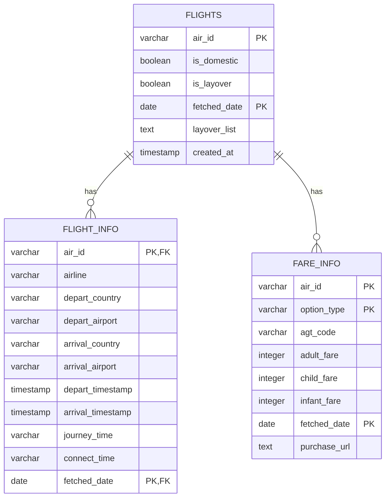

# 네이버 항공권 DB 스키마

## DB 스키마

```mermaid
erDiagram
    FLIGHTS ||--o{ FLIGHT_INFO : has
    FLIGHTS ||--o{ FARE_INFO : has
    FLIGHTS {
        varchar air_id PK
        boolean is_domestic
        boolean is_layover
        date fetched_date PK
        text layover_list
        timestamp created_at
    }
    FLIGHT_INFO {
        varchar air_id PK, FK
        varchar airline
        varchar depart_country
        varchar depart_airport
        varchar arrival_country
        varchar arrival_airport
        timestamp depart_timestamp
        timestamp arrival_timestamp
        varchar journey_time
        varchar connect_time
        date fetched_date PK, FK
    }
    FARE_INFO {
        varchar air_id PK
        varchar option_type PK
        varchar agt_code
        integer adult_fare
        integer child_fare
        integer infant_fare
        date fetched_date PK
        text purchase_url
    }
```