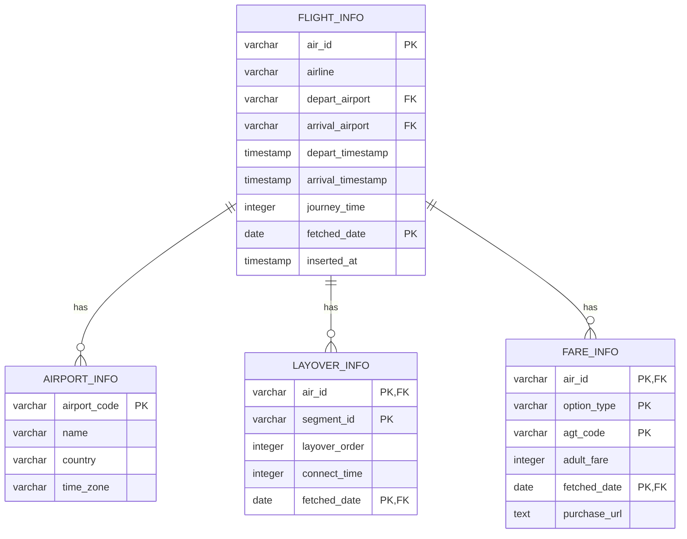

# 항공권 DB

본 문서는 네이버 항공권과 스카이스캐너 항공권 데이터베이스의 구조에 대한 문서입니다.

## 데이터베이스 스키마



## 테이블 구조

### AIRPORT_INFO 테이블

| 컬럼명 | 데이터 타입 | 설명 | 예시 |
|--------|------------|------|------|
| airport_code | varchar(10) | 공항 코드 (PK) | ICN |
| name | varchar(100) | 공항 이름 | 인천국제공항 |
| country | varchar(100) | 국가 | 대한민국 |
| time_zone | varchar(100) | 시간대 | Asia/Seoul |

### FLIGHT_INFO 테이블

| 컬럼명 | 데이터 타입 | 설명 | 예시 |
|--------|------------|------|------|
| air_id | varchar(100) | 항공권 ID (PK) | 20240927ICNPUSKE1827 |
| airline | varchar(30) | 항공사 | 대한항공 |
| depart_airport | varchar(10) | 출발 공항 (FK) | ICN |
| arrival_airport | varchar(10) | 도착 공항 (FK) | PUS |
| depart_timestamp | timestamp | 출발 시간 | 2024-09-27 18:27:00 |
| arrival_timestamp | timestamp | 도착 시간 | 2024-09-27 19:30:00 |
| journey_time | integer | 비행 시간 (분) | 63 |
| fetched_date | date | 수집 날짜 (PK) | 2024-08-20 |
| inserted_at | timestamp | DB에 삽입된 시간 | 2024-08-20 04:16:16.307186+09 |

### FARE_INFO 테이블

| 컬럼명 | 데이터 타입 | 설명 | 예시 |
|--------|------------|------|------|
| air_id | varchar(100) | 항공권 ID (PK, FK) | 20240927ICNPUSKE1827 |
| option_type | varchar(50) | 구매 유형 (PK) | 성인/우리카드 |
| agt_code | varchar(50) | 여행사 코드 (PK) | INT005 |
| adult_fare | integer | 성인 요금 | 210800 |
| fetched_date | date | 수집 날짜 (PK, FK) | 2024-08-20 |
| purchase_url | text | 결제 페이지 URL | https://... |

### LAYOVER_INFO 테이블

| 컬럼명 | 데이터 타입 | 설명 | 예시 |
|--------|------------|------|------|
| air_id | varchar(100) | 항공권 ID (PK, FK) | 20240927ICNPUSKE1827 |
| segment_id | varchar(50) | 구간 ID (PK) | SEG001 |
| layover_order | integer | 경유 순서 | 1 |
| connect_time | integer | 연결 시간 (분) | 120 |
| fetched_date | date | 수집 날짜 (PK, FK) | 2024-08-20 |

## 참고 사항
- 공항 정보는 airport_info 테이블에서 공항 코드를 key로 찾을 수 있습니다.
- 출발 시간과 도착 시간은 UTC (세계 협정시) 기준으로 저장되어 있습니다. 필요시 airport_info의 time_zone에 맞춰 공항 위치에 따른 시간대 변환이 가능합니다.
- 경유 항공권의 경우 해당 항공권을 구성하는 편도 항공권들의 id와 경유 순서, 환승 시간이 layover_info 테이블에 저장되어 있습니다. 필요시 추가 분석이 가능합니다.

## 테이블 생성 SQL 쿼리

```sql
-- airport_info 테이블 생성
CREATE TABLE airport_info (
    airport_code VARCHAR(10) NOT NULL,
    name VARCHAR(100),
    country VARCHAR(100),
    time_zone VARCHAR(100),
    PRIMARY KEY (airport_code)
);

-- flight_info 테이블 생성
CREATE TABLE flight_info (
    air_id VARCHAR(100) NOT NULL,
    airline VARCHAR(30),
    depart_airport VARCHAR(10),
    arrival_airport VARCHAR(10),
    depart_timestamp TIMESTAMP,
    arrival_timestamp TIMESTAMP,
    journey_time INTEGER,
    fetched_date DATE NOT NULL,
    inserted_at TIMESTAMP DEFAULT CURRENT_TIMESTAMP,
    PRIMARY KEY (air_id, fetched_date),
    FOREIGN KEY (depart_airport) REFERENCES airport_info(airport_code),
    FOREIGN KEY (arrival_airport) REFERENCES airport_info(airport_code)
);

-- fare_info 테이블 생성
CREATE TABLE fare_info (
    air_id VARCHAR(100) NOT NULL,
    option_type VARCHAR(50),
    agt_code VARCHAR(50),
    adult_fare INTEGER,
    fetched_date DATE NOT NULL,
    purchase_url TEXT,
    PRIMARY KEY (air_id, option_type, agt_code, fetched_date),
    FOREIGN KEY (air_id, fetched_date) REFERENCES flight_info(air_id, fetched_date)
);

-- layover_info 테이블 생성
CREATE TABLE layover_info (
    air_id VARCHAR(100) NOT NULL,
    segment_id VARCHAR(50) NOT NULL,
    layover_order INTEGER,
    connect_time INTEGER,
    fetched_date DATE NOT NULL,
    PRIMARY KEY (air_id, segment_id, fetched_date),
    FOREIGN KEY (air_id, fetched_date) REFERENCES flight_info(air_id, fetched_date)
);
```